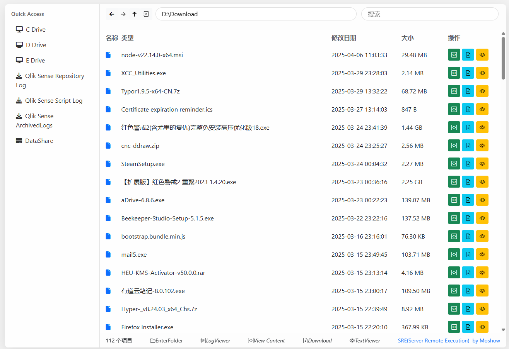
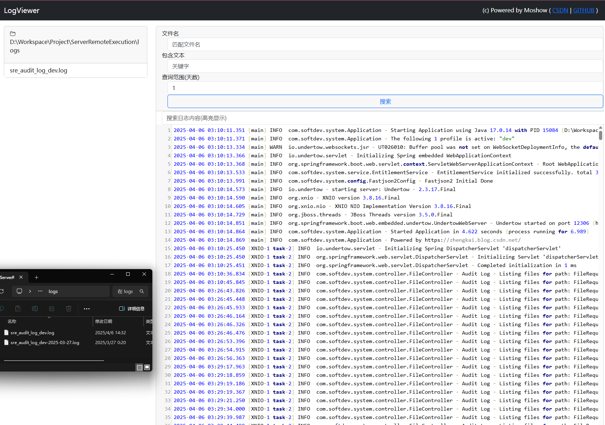

# ServerRemoteExecution
----
ServerRemoteExecution，基于SpringBoot3的服务器远程维护工具，支持查看日志(<10m)和列出文件，下载文件等操作，也支持远程执行白名单的powershell命令，web容器为Undertow(非默认tomcat)，其他的请自行添加和配置。

*.无DB连接型，审计操作请从log文件中提取。 支持Windows Only(目前)。

*.Powered by **Moshow郑锴**@https://zhengkai.blog.csdn.net/

# 功能
- ### Folder 文件夹操作
    - FolderExplorer —— 目录浏览功能
    - LogViewer —— 以专业日志模式打开目录(支持文件名匹配和文件内容搜索，以及关键字高亮)
- ### File 文件操作
    - TextViewer文本编辑器查看模式(只读)
    - ViewContent直接查看文件内容(适合小文件)
    - Download直接下载文件
- ### Command 命令执行(Powershell)
    - Execute执行命令(带审计日志)


# 如何运行
1. 首先确保你是JDK17(SpringBoot2.7需要JDK11,SpringBoot3需要JDK17)，推荐微软的MSJDK17
2. 使用Maven安装类库，国内推荐使用阿里云Maven镜像，`mvn clean compile`
3. 项目已配置新版的SpringBoot3.3，需要2.7X版本请从SpringBoot2分支中提取
4. 找到Application，运行项目
5. 访问`http://localhost:12306/sre/` ，会显示`hello world - https://zhengkai.blog.csdn.net/`


TEST SHELL
----
- `Get-Item .`
- `Get-Process java`

版本更新
----
| 版本         | 更新内容                                                                                                                             |
|------------|----------------------------------------------------------------------------------------------------------------------------------|
| 2025-04-06 | 优化FileExplorer文件管理器，支持自定义路径，易用性改进，修复搜索框问题<br>优化PowershellExecutor，新增编码选择以及常用命令快速输入 <br>优化LogViewer，新增查询范围天数限制，便于检索日志             |
| 2025-03-11 | LogViewer:优化日志浏览器样式，包括日志样式和高度问题。                                                                                                 |
| 2025-03-11 | FileExplorer:文本浏览区域下移至网页底部，对于长文本浏览时效果更友好<br>LogViewer:由于Ace渲染性能问题，编辑器更换为CodeMirror5。                                             |
| 2025-03-10 | ShellExecutor:<br>1.修复shell界面执行命令api路径问题<br>2.修复上下按钮或者键盘上下键调用上一次/下一次命令失效问题<br>3.执行按钮新增防抖功能。<br>4.新增logback审核日志配置功能，可定制日志输出样式和路径。 |
| 2025-03-09 | 新增LogViewer并支持日志文件名匹配和日志内容查找                                                                                                     |
| 2025-03-08 | 优化TextViewer功能                                                                                                                   |
| 2025-03-06 | 优化文件下载和简单文本内容浏览功能                                                                                                                |
| 2025-03-04 | 实现文件目录查看以及文本浏览(完善中)                                                                                                              |
| 2025-03-03 | 新增登录页面和Landing Page，静态文件本地化                                                                                                      |
| 2025-03-02 | initial version                                                                                                                  |

预览
----






List folder API
----
Visit `http://localhost:12306/sre/list` to list folder.

Request Body
```json
{
  "filePath":"D:\\Download\\",
  "userName":"admin"
}
```

Return Body
```json
[
  {
    "directory": false,
    "lastModified": "2025-03-02 20:45:53",
    "name": "removeYoudao.js",
    "path": "D:\\Download\\removeYoudao.js",
    "size": "0"
  }
]
```


Read Log (Size<10m) | Download File
----
**Visit** `http://localhost:12306/sre/read` to read log or `http://localhost:12306/sre/download` to download the file.

**Request Body**
```json
{
 "filePath":"D:\\Download\\removeYoudao.js",
 "userName":"admin"
}
```

**Response Body**
```text
NOT A JSON Object BUT YOUR FILE CONTENT
```

Execute Command
----
Visit `http://localhost:12306/sre/execute` to execute command.

**Request Body**
```json
{
  "command":"Get-Item .",
  "userName":"admin"
}
```

**Response Body**
```text
    Ŀ¼: D:\Workspace\Project


Mode                 LastWriteTime         Length Name                                                                 
----                 -------------         ------ ----                                                                 
d-----          2025/3/3      0:14                ServerRemoteExecution                                                
```